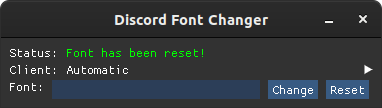

# DiscordFontChanger 📜
A cross-platform tool for quickly changing Discord's font!

**DiscordFontChanger** Has no setup/installation steps and is built with simplicity in mind.

# Usage
To use **DiscordFontChanger** you'll just need to download latest binary for your operating-system from the [releases](https://github.com/Kid0h/DiscordFontChanger/releases) page, or [build from source](#building-from-source).

<!-- Changing fonts is as easy as entering the desired font's name and pressing `Enter` or clicking `Change`! -->

To change Discord's font, enter the font's name and press `Enter` or click the `Change` button:

> Note: the font has to be installed on your machine for the tool to work properly.


If you have different Discord clients installed alongside each other, you can target a specific one by selecting it in the `Client` drop-down menu: 


If you want to reset Discord's font back to the default, just click the `Reset` button or leave the font text box empty and click the `Change` button:



# Building from source
<<<<<<< HEAD
First thing you'll need to do is clone the repository to your machine using `--recursive` to clone the needed submodules too:
```bash
git clone --recursive https://github.com/Kid0h/DiscordFontChanger
=======
**DiscordFontChanger** has no dependencies and could be compiled "out of the box" with C++-17 (needed for \<filesystem\>) enabled.
First thing you'll need to do is clone the repository to your local machine:
```sh
git clone https://github.com/Kid0h/DiscordFontChanger
>>>>>>> 0566a95943481796b3536894f3e2efaf4553f678
cd DiscordFontChanger
```
Use the CMake script (`CMakeLists.txt`) provided with the tool to easily compile it using CMake:
```bash
mkdir build && cd build
cmake ..
cmake --build .
```

## Reaching out
If you have any issues or questions - you can open an issue [here](https://github.com/Kid0h/DiscordFontChanger/issues/new)!